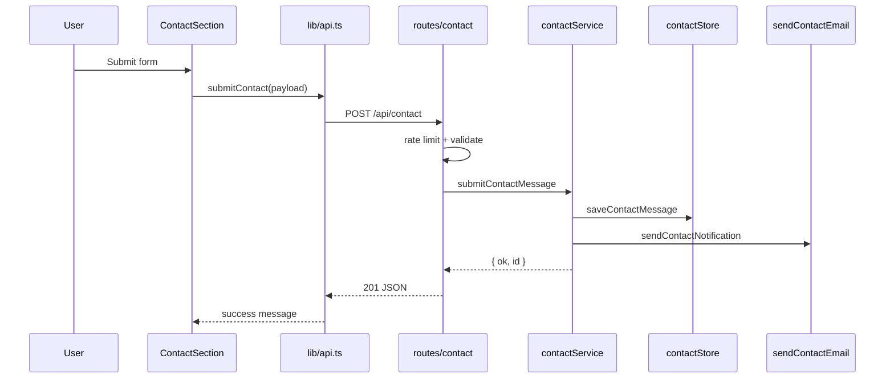

# Codebase structure

IT portfolio for **Yousef Samman** — single-page React site with a small Express API for contact form, CV download, and health checks.

## Folder overview

```
yousef-samman-portfolio/
├── public/                 # Static assets served by Vite
│   ├── cv/                 # CV PDF (YousefCv.pdf)
│   ├── favicon.svg
│   ├── robots.txt
│   └── sitemap.xml
├── server/                 # Express API (port 3001)
│   ├── index.ts            # App entry, mounts routes & middleware
│   ├── middleware/         # Cross-cutting HTTP middleware
│   ├── routes/             # Request/response handlers only
│   ├── services/           # Business logic (contact submission)
│   └── lib/                # Persistence, email, validation, rate limits
├── src/                    # React frontend (port 3000)
│   ├── pages/              # Page-level layout & composition
│   ├── components/         # Reusable UI sections
│   ├── data/               # Static portfolio content
│   ├── hooks/              # Reusable React logic
│   ├── lib/                # Frontend API client & analytics
│   ├── theme/              # Tailwind class tokens (NOC dark theme)
│   ├── config/             # App constants (nav section IDs)
│   ├── types/              # Shared TypeScript types
│   └── utils/              # Pure helpers (tenure formatting)
├── docs/                   # Feature specs (e.g. contact admin plan)
├── .env.example            # Placeholder env vars (no secrets)
└── CODEBASE_STRUCTURE.md   # This file
```

## Frontend (`src/`)

| Path | Responsibility |
|------|----------------|
| `App.tsx` | Root component — renders `PortfolioPage` |
| `main.tsx` | React mount + analytics init |
| `pages/PortfolioPage.tsx` | Composes all sections, hooks, backdrop, boot overlay |
| `components/PortfolioHeader.tsx` | Name, social links, scroll-spy nav |
| `components/HeroSection.tsx` | About, photo, slogan, CV download |
| `components/ExperienceSection.tsx` | Timeline with tenure bars |
| `components/ProjectsSection.tsx` | Project list linking to GitHub |
| `components/EducationSkillsSection.tsx` | Education card + tech toolkit |
| `components/ContactSection.tsx` | Contact form UI + submit state |
| `components/SkillList.tsx` | Stack/tools rows with icons |
| `components/NocBackdrop.tsx` | Animated network operations background |
| `components/NetworkBootOverlay.tsx` | First-load boot animation |
| `components/PortfolioFooter.tsx` | Copyright line |
| `data/content.ts` | Name, location, hero copy, certificates |
| `data/experience.ts` | Roles + computed tenure |
| `data/projects.ts` | Project cards |
| `data/skills.ts` | Tech stack/tool icons |
| `data/nocBackdrop.ts` | RF ripple site positions |
| `hooks/useActiveNavSection.ts` | Scroll-spy for nav highlight |
| `hooks/useBootOverlay.ts` | Boot overlay timing |
| `hooks/useCvAvailability.ts` | Fetches `/api/cv/status` |
| `hooks/usePortfolioNocClass.ts` | Adds `portfolio-noc` on `<html>` |
| `lib/api.ts` | `submitContact`, `fetchCvStatus`, CV URL |
| `lib/analytics.ts` | Optional Plausible loader |
| `theme/portfolioTheme.ts` | Centralized Tailwind class strings |

### Main frontend flow

1. `main.tsx` mounts `App` → `PortfolioPage`.
2. `PortfolioPage` loads theme, runs hooks (nav, CV, boot, NOC class).
3. User scrolls sections (`#about`, `#experience`, …); nav updates via `useActiveNavSection`.
4. **Contact:** `ContactSection` calls `submitContact()` in `lib/api.ts` → `POST /api/contact` (proxied to port 3001 in dev).
5. **CV:** Hero link uses `/api/cv`; availability from `GET /api/cv/status`.

## Backend (`server/`)

| Path | Responsibility |
|------|----------------|
| `index.ts` | Express app, JSON body, CORS, health, route mount |
| `middleware/cors.ts` | CORS headers + OPTIONS preflight |
| `routes/contact.ts` | `POST /api/contact` — rate limit, validate, delegate to service |
| `routes/cv.ts` | `GET /api/cv`, `GET /api/cv/status` |
| `services/contactService.ts` | Save message + send notification email |
| `lib/validators.ts` | `parseContactBody`, honeypot (`website` field) |
| `lib/contactStore.ts` | Append messages to `data/contact-messages.jsonl` |
| `lib/rateLimit.ts` | In-memory IP rate limit + daily email cap key |
| `lib/sendContactEmail.ts` | Gmail SMTP (Nodemailer) or Resend API |

### Main backend flow (contact)

```
POST /api/contact
  → routes/contact.ts     (rate limit, parse body)
  → services/contactService.ts
       → lib/contactStore.ts      (persist JSONL)
       → lib/sendContactEmail.ts  (optional notify email)
  → 201 { ok, message, id }  (if save succeeded)
```

Email failure is logged but does **not** block a successful save (visitor still gets 201).

## Data flow (UI → API → storage → email)



## Environment variables

Copy `.env.example` → `.env.local` (never commit `.env.local`).

| Variable | Purpose |
|----------|---------|
| `PORT` | API port (default `3001`) |
| `APP_URL` | Public site URL when deployed |
| `CORS_ORIGIN` | Restrict API CORS in production |
| `CV_FILENAME` | PDF name under `public/cv/` |
| `CONTACT_COOLDOWN_MINUTES` | Min minutes between messages (same IP or email; default **15**) |
| `CONTACT_RATE_LIMIT_PER_HOUR` | Max submissions per IP per rolling hour (default **8**) |
| `VITE_TURNSTILE_SITE_KEY` | Cloudflare Turnstile site key (frontend) |
| `TURNSTILE_SECRET_KEY` | Turnstile secret (server verification) |
| `CONTACT_NOTIFY_EMAIL` | Inbox for form alerts |
| `CONTACT_EMAIL_DAILY_CAP` | Max notification emails per 24h |
| `SMTP_HOST`, `SMTP_PORT`, `SMTP_USER`, `SMTP_PASS` | Gmail SMTP |
| `RESEND_API_KEY`, `CONTACT_EMAIL_FROM` | Optional Resend instead of SMTP |
| `VITE_PLAUSIBLE_DOMAIN` | Optional analytics (frontend) |

## How to run

**Both frontend and API (recommended):**

```bash
npm install
npm run dev:all
```

- Site: http://localhost:3000  
- API health: http://localhost:3001/api/health  

**Separate terminals:**

```bash
npm run server   # API on 3001
npm run dev      # Vite on 3000 (proxies /api → 3001)
```

**Production build (frontend only):**

```bash
npm run build
npm run preview
```

Run the API separately in production (same `server/index.ts` process).

**Type check:**

```bash
npm run lint
```

## Explaining the project in a demo

1. **Single-page portfolio** — dark NOC-themed UI; sections map to nav: Info, Timeline, Projects, Education & Tools, Get in Touch.
2. **Content lives in `src/data/`** — easy to update copy, roles, and projects without touching layout code.
3. **UI is split by section** — each file in `src/components/` is one screen area; `PortfolioPage` wires them together.
4. **Small API** — contact form with validation, rate limits, local JSONL backup, and optional email to your private inbox (credentials only in `.env.local`).
5. **Privacy** — no public email/phone on the site; visitors use the form only.

## Known limitations

- Contact messages stored in `data/contact-messages.jsonl` on the server filesystem (not a database).
- Rate limiting is in-memory (resets on server restart).
- Admin UI for messages is planned (`docs/CONTACT-EMAIL-AND-ADMIN.md`) but not implemented yet.
- OG/social preview image may still need a custom asset before go-live.
- Review `public/cv/YousefCv.pdf` for personal contact details before publishing.

## Manual checks before go-live

- [ ] `.env.local` configured for email (`CONTACT_NOTIFY_EMAIL` + SMTP or Resend)
- [ ] Submit test message; confirm JSONL entry and inbox email
- [ ] CV download works from hero button
- [ ] No personal email/phone visible in page source
- [ ] `npm run lint` and `npm run build` pass
