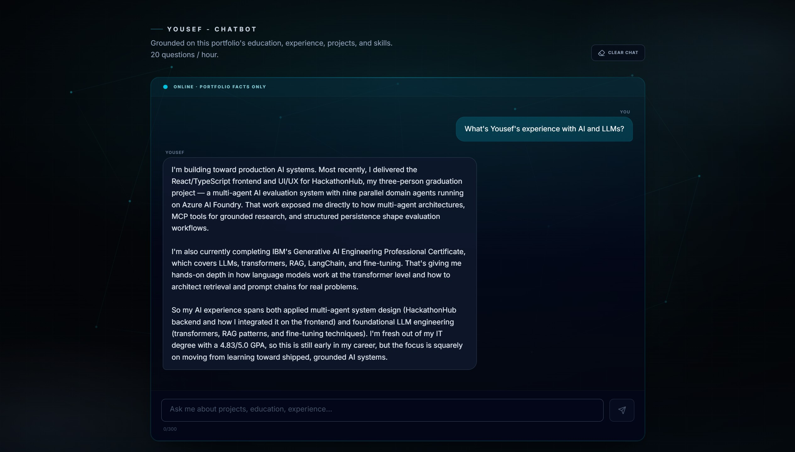

# Yousef Samman — Portfolio

A grounded Claude assistant on a React + Express portfolio — context-anchored answers about background, projects, and skills, with prompt-injection guards and cost controls.

**Live:** [https://portfolio-peach-kappa-zftmxyoyax.vercel.app/](https://portfolio-peach-kappa-zftmxyoyax.vercel.app/)


## The grounded AI assistant



Visitors ask about education, experience, projects, and skills. Answers come only from a server-side structured context file (`server/data/aboutContext.ts`) injected into a strict system prompt — not from open web search or a general chat personality.

**Model:** `claude-haiku-4-5-20251001` via the Anthropic SDK, with `max_tokens` capped at 500. Haiku is the right fit here: short factual answers over a small fixed corpus, where latency and cost matter more than long-form generation.

**Grounding:** This is **context-injection grounding, not RAG**. The corpus is small, fixed, and fully known (identity, education, roles, projects, skills). Retrieving chunks would add complexity without improving accuracy for this shape of data. The model is instructed to refuse inventing facts and to decline off-topic, roleplay, jailbreaks, and instruction-override attempts.

**Containment backstops:** Prompt rules alone are probabilistic. A deterministic `stripAssistantMarkdown` pass removes bold/italics/links/headings so the chat UI stays plain text even if the model drifts.

**Cost and abuse control:**
- Per-IP hourly limit (`ASSISTANT_RATE_LIMIT_PER_HOUR`, default **20**) — stops one visitor from burning the quota.
- Global daily cap (`ASSISTANT_DAILY_GLOBAL_CAP`, default **100**) — stops a burst of traffic (or many IPs) from running up an unexpected Anthropic bill.

**Without `ANTHROPIC_API_KEY`:** the API returns **503** (`not_configured`) and the UI shows the assistant as unavailable — the rest of the site still works.

Endpoint: `POST /api/assistant` (validated body + optional multi-turn `history`).

## Architecture

```
routes/  →  services/  →  lib/
```

Handlers stay thin. Business logic lives in services. Pure helpers (validation, rate limits, cooldown, email transport) live in `lib/`.

Assistant results use a discriminated union:

| `reason` | HTTP |
|----------|------|
| `hourly` / `daily_cap` | **429** |
| `not_configured` | **503** |
| `upstream` | **502** |

Contact form defense is layered on purpose:

1. **Honeypot** (`website`) — catches naive bots before any expensive work  
2. **Cooldown** (IP + email) — spaces out repeat humans  
3. **Per-IP hourly rate limit** — caps sustained abuse  
4. **Turnstile** — challenges automated clients when configured  

Four mechanisms because each fails differently; none is enough alone.

**Known boundary:** rate-limit and cooldown state are in-process `Map`s — correct for a single API instance; a multi-instance deploy would need a shared store. Not fixed here by design.

Folder detail: [docs/CODEBASE_STRUCTURE.md](docs/CODEBASE_STRUCTURE.md).

## Tech stack

| Layer | Technology |
|-------|------------|
| Frontend | React 19, TypeScript, Vite 6, Tailwind CSS 4, React Router |
| Backend | Node.js, Express 4, tsx |
| AI / LLM | Anthropic SDK — `claude-haiku-4-5-20251001` |
| Email | Resend (HTTPS; required on Render) or Nodemailer SMTP (local) |
| CAPTCHA | Cloudflare Turnstile (optional) |
| Tests | Vitest |

## Features

| Feature | How it works |
|---------|----------------|
| **Grounded ChatBot** | `POST /api/assistant` — Haiku + system prompt + `aboutContext`; 20/hour per IP; 100/day global; 503 without API key |
| **Contact form** | `POST /api/contact` — validation, honeypot, Turnstile (when set), 15 min cooldown (IP + email), 8/hour per IP, JSONL save + email |
| **CV download** | `GET /api/cv` / `GET /api/cv/status` |
| **Health** | `GET /api/health` |
| **Portfolio UI** | Home sections, projects routes, contact page, dark AI theme |
| **SEO** | Meta, Open Graph, Twitter card, `robots.txt`, `sitemap.xml` |

Full checklist and privacy notes: [docs/FEATURES.md](docs/FEATURES.md).

## Run locally

```bash
git clone https://github.com/Yousef-Samman/Portfolio.git
cd Portfolio
npm install
cp .env.example .env.local
npm run dev:all
```

- Site: http://localhost:3000  
- API: http://localhost:3001 (`/api/health`)

**Required for full assistant:** `ANTHROPIC_API_KEY`  
**Required for contact email on Render:** `RESEND_API_KEY` + `CONTACT_NOTIFY_EMAIL`  
**Optional:** Turnstile keys, SMTP (local), `VITE_PLAUSIBLE_DOMAIN`, production `VITE_API_URL` / `CORS_ORIGIN`

Without those keys, the site still runs; assistant and/or email degrade gracefully (503 / skip notify).

```bash
npm test
npm run lint
npm run build
```

## Built with an AI-assisted workflow

Features were specified before implementation. Specs live in [docs/Prompts/](docs/Prompts/) — see [docs/Prompts/README.md](docs/Prompts/README.md) for the workflow and which prompts shipped vs stayed unbuilt (case-study template and learning tracker are **specced, not on the live site**).

Mine: the route / service / lib split, discriminated-union API results, the two-tier assistant rate limits (per-IP + global daily), the cooldown-resolver bug found by tests and fixed so enforcement and reported wait agree, plus integration and review of generated code.

## Tests

Vitest covers pure boundary logic:

- `validators` — contact + assistant body limits, honeypot, history caps  
- `rateLimit` — exact max, retry-after, window reset, key isolation  
- `contactCooldown` — IP/email expiry, unified minutes resolver  
- `tenure` — formatting and ongoing-role edge cases  

```bash
npm test
```

Example: the suite caught `contactCooldownMinutes()` disagreeing with enforcement when `CONTACT_COOLDOWN_MINUTES` was `0`; both now share one clamped resolver.

## Deployment

Step-by-step: [docs/GOING-LIVE.md](docs/GOING-LIVE.md) (Vercel frontend + Render API).

Render blocks outbound Gmail SMTP. The email layer detects Render hosts and prefers **Resend over HTTPS**; local dev can still use SMTP when Resend is unset.

## License

[MIT](LICENSE) © Yousef Samman
